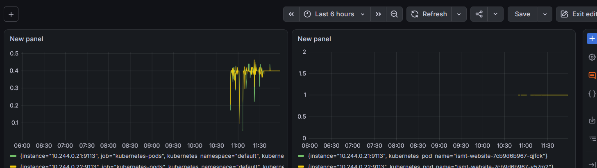

# 🎓 ISMT College Website

### A real college website, taken all the way from plain HTML to a fully automated, monitored, production-style deployment.

`HTML5` `Docker` `Kubernetes` `ArgoCD` `Grafana`

---

## 📖 What is this project?

This started as a simple, responsive website for ISMT College — plain
HTML, CSS, and JavaScript, no frameworks. That part is done and it
works great on its own.

But the real goal of this project was bigger: **take an ordinary
website and run it through the exact same process real companies use
to ship and run software in production** — build it, test it
automatically, package it, deploy it to a live cluster, and watch over
it while it runs.

So this repo tells two stories at once:
1. **A website** — pages, styling, a working contact form, a
   responsive layout.
2. **A pipeline** — everything that happens *around* that website to
   turn it into something reliably running in the cloud.

---

## 🌐 The Website

| Page | File | What it's for |
|---|---|---|
| Home | `index.html` | Hero banner, highlights, featured courses |
| About | `about.html` | Institute background and mission |
| Courses | `courses.html` | Full list of available courses |
| Course Detail | `course-inner.html` | Deep-dive on one course |
| Blog | `blog.html` | List of articles |
| Post | `post.html` | A single blog post |
| Contact | `contact.html` | Contact form and details |

**Highlights:**
- Fully responsive, mobile-friendly navigation
- Smooth fade-in animations as you scroll
- Sticky navbar, back-to-top button, live countdown timer
- Client-side form validation with helpful inline feedback
- Clean, accessible markup with proper alt text and SEO-friendly titles

**Screenshots:**


*Homepage*


*About*


*Courses*


*Blog*


*Contact*

**Run it the simple way** (just the website, no DevOps needed):
```bash
git clone https://github.com/kabi101010/-Ismt-website.git
# Open index.html with VS Code's "Live Server" extension
```

---

## ⚙️ The Pipeline: How This Site Actually Gets Deployed

Here's the part that turns "a website" into "a website running the
way a real engineering team would run it."

```
 You push code to GitHub
          │
          ▼
 GitHub Actions runs automatically:
   ✔ checks the HTML/CSS
   ✔ scans for accidentally leaked secrets
   ✔ builds a Docker image and scans it for vulnerabilities
          │
          ▼
 ArgoCD notices the change in GitHub
   and deploys it — automatically, no one
   has to run a deploy command by hand
          │
          ▼
 The website runs inside Kubernetes
   with 2 copies running side by side
   (if one crashes, the other keeps serving traffic)
          │
          ▼
 Prometheus + Grafana quietly watch it
   tracking traffic and confirming it's healthy,
   24/7
```

In plain terms: **push code → it's automatically checked, built,
deployed, and monitored — with no manual steps in between.**

### 🐳 1. Docker — packaging the site

The website is served by **Nginx**, a small, fast web server, all
bundled into one portable container:

```bash
docker build -t ismt-website .
docker run -d -p 8081:80 ismt-website
```

### 🔄 2. CI/CD — automatic checks on every push

A GitHub Actions pipeline (`.github/workflows/ci.yml`) runs three
checks every time code is pushed:
- **HTML validation** — catches broken markup
- **Secret scanning** (Gitleaks) — catches accidentally committed
  passwords or keys
- **Vulnerability scanning** (Trivy) — scans the built Docker image
  for known security issues

> **A real judgment call:** this site was built from a third-party
> template with some pre-existing markup quirks (harmless, but
> technically not "valid" HTML5). Rather than rewriting someone else's
> template line-by-line, HTML validation is treated as informational
> rather than a hard blocker — a common, practical choice when
> inheriting existing front-end code.

### ☸️ 3. Kubernetes — running it reliably

The site runs as **2 replicas** in Kubernetes, with health checks that
automatically restart it if something goes wrong.

### 📦 4. Helm — packaging the deployment config

Instead of hand-editing YAML files, the Kubernetes setup is packaged
as a **Helm chart** (`helm/ismt-website/`) — one command deploys it,
and settings like replica count or image version can be changed
without touching the underlying templates.

```bash
helm install ismt-website helm/ismt-website
```

### 🔁 5. GitOps with ArgoCD — deployments that happen by themselves

**ArgoCD** watches this GitHub repo. When something changes, it
updates the live deployment automatically — no one needs to run
`kubectl` or `helm` by hand. Git *is* the source of truth.

### 📊 6. Monitoring — watching it while it runs

A static website doesn't normally expose any data about its own
health. To fix that, each pod runs a small **exporter** sidecar
alongside Nginx, which reads Nginx's internal stats and turns them
into data Prometheus can understand. Prometheus then finds these pods
automatically (no manual setup per pod), and Grafana turns the numbers
into a live dashboard:



- **Request Rate** — how much traffic each pod is handling right now
- **Uptime** — whether each pod is healthy (green line = good)

---

## 🧠 What I actually learned building this

- How to take a plain static site and containerize it properly
- How CI/CD pipelines catch problems *before* they reach production
- How Helm turns repetitive YAML into something clean and reusable
- How GitOps means "Git is in charge," not a person manually deploying
- How to monitor something (like Nginx) that doesn't naturally speak
  Prometheus's language, using a sidecar exporter
- Real debugging: a Kubernetes permission error that needed a specific
  fix (RBAC), a PowerShell quoting issue that broke a command until I
  used a patch file instead, and a password reset after a tool's
  command name changed between versions
- That real engineering sometimes means making a fair, practical
  decision (like the HTML validation call above) instead of chasing
  perfection on something outside the actual scope of the work

---

## 🛠️ Tech Stack

**Website:** HTML5 · CSS3 · JavaScript · jQuery
**DevOps:** Docker · GitHub Actions · Gitleaks · Trivy · Kubernetes ·
Helm · ArgoCD · Prometheus · Grafana

---

## 🚀 What's Next

- Add alerting so I get notified automatically if the site ever goes down
- Apply this same pipeline to a real small organization's website
