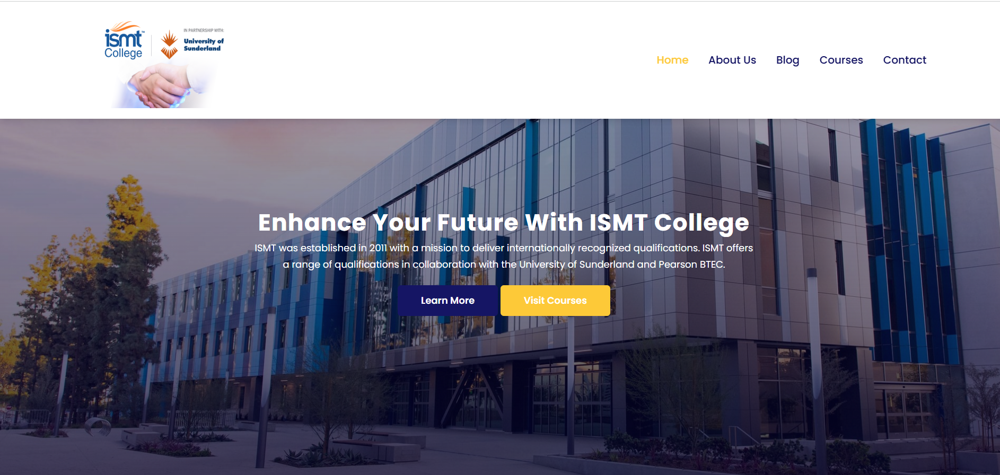
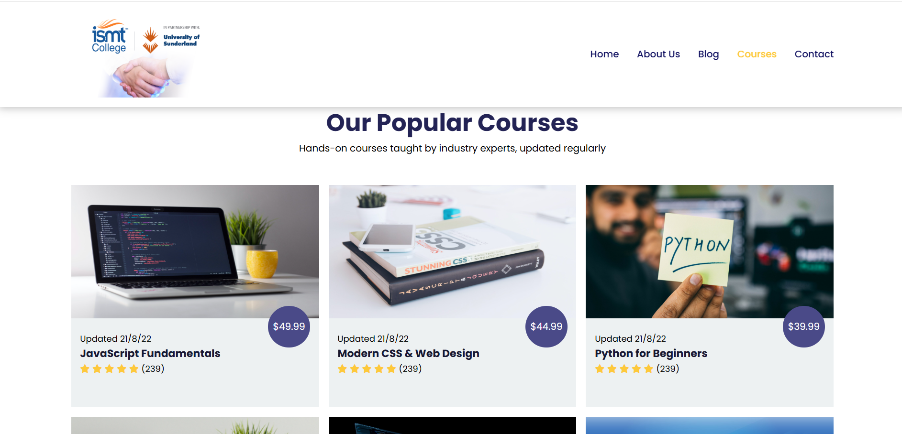
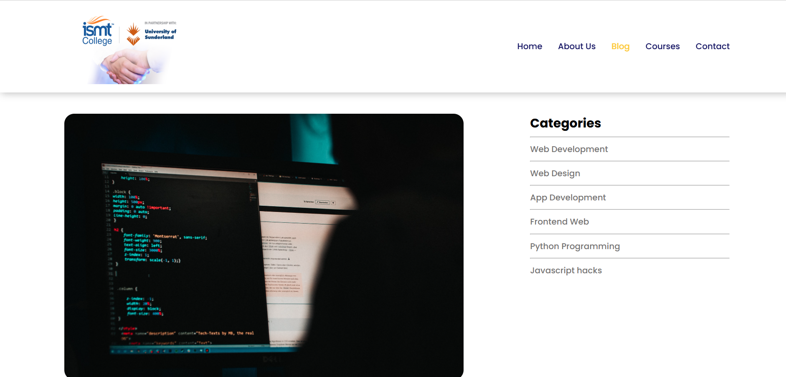
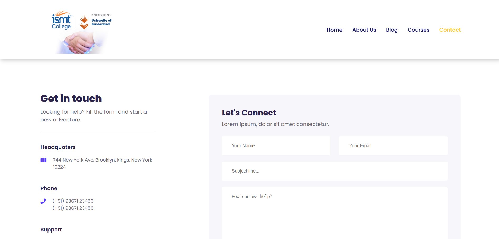

# ISMT College Website

A responsive, multi-page website for ISMT College, built with plain HTML5, CSS3, and vanilla JS/jQuery. No frameworks, no build step, just open and run.

## Live Preview

Run locally with VS Code's Live Server extension, see Running Locally below, or add a GitHub Pages link here once deployed.

## Pages

| Page | File | Description |
|---|---|---|
| Home | index.html | Landing page with hero banner, highlights, featured courses, and trust/partner logos. |
| About | about.html | Information about the institute, its mission, and background. |
| Courses | courses.html | Listing of all available courses. |
| Course Detail | course-inner.html | Detailed view of a single course. |
| Blog | blog.html | List of blog articles. |
| Post | post.html | Individual blog post page. |
| Contact | contact.html | Contact form and details. |

## Screenshots

<table>
<tr>
<td width="50%"><b>Homepage</b> </td>
<td width="50%"><b>About</b> </td>
</tr>
<tr>
<td width="50%"><b>Courses</b> </td>
<td width="50%"><b>Blog</b> </td>
</tr>
<tr>
<td width="50%"><b>Contact</b> </td>
<td width="50%"></td>
</tr>
</table>

## Features

- Responsive mobile menu with auto-close on link tap
- Active page highlighting in the navigation
- Sticky navbar with a scroll shadow
- Fade-in scroll animations on sections and cards
- Floating back-to-top button
- Live countdown timer on the homepage registration section
- Client-side validation with inline feedback on the contact, registration, and newsletter forms
- Real, distinct course titles and prices matching each course image
- SEO-friendly meta descriptions and unique page titles on every page
- Descriptive alt text on logo, course, and profile images for accessibility
- Education-relevant footer content

## Tech Stack

- HTML5
- CSS3
- Vanilla JS + jQuery (script.js, shared across all pages)
- No build tools or dependencies required

## Running Locally

1. Clone this repo: git clone https://github.com/kabi101010/-Ismt-website.git
2. Open the folder in VS Code.
3. Install the Live Server extension.
4. Right-click index.html and choose Open with Live Server.
5. The site will open in your browser and auto-reload as you make changes.

## Project Structure

ismt-website-main/
- index.html (Homepage)
- about.html, about.css
- courses.html
- course-inner.html, course-inner.css
- blog.html, blog.css
- post.html, post.css
- contact.html, contact.css
- style.css (Shared/global styles)
- script.js (Shared site JavaScript)
- img/ (Images and icons)
- screenshots/ (README screenshots)

## License

Add your license here (e.g. MIT), or note that this is a personal/learning project.